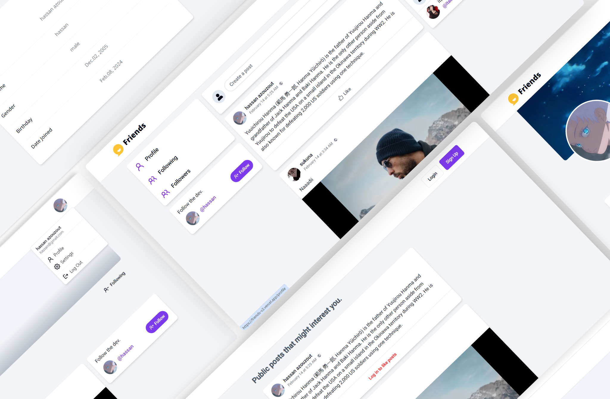
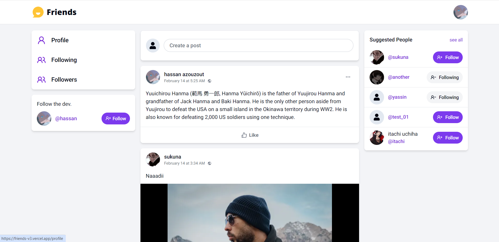
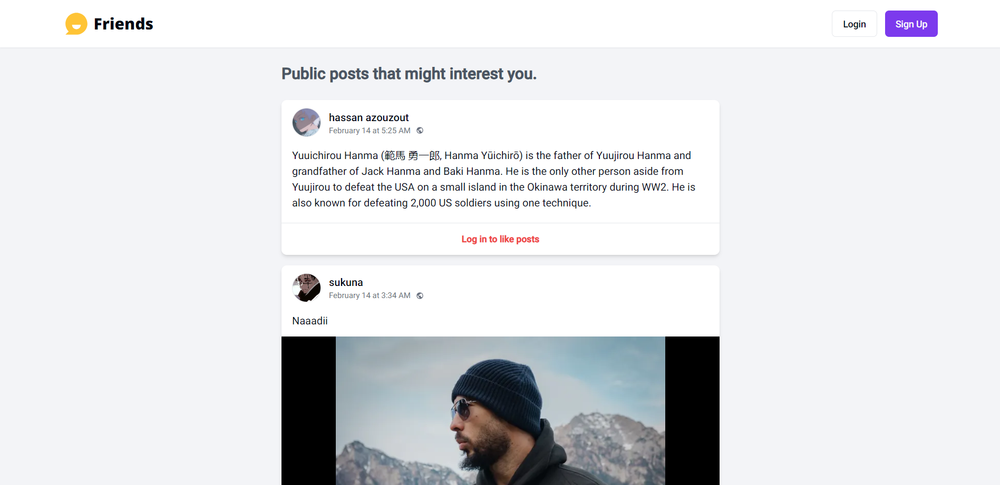
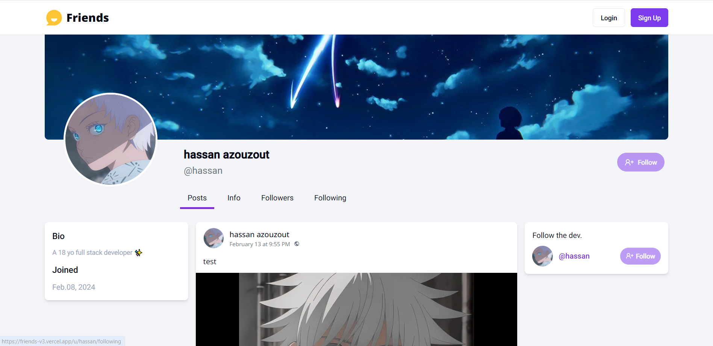
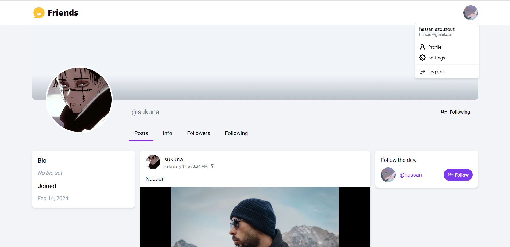

# Friends: Social Media Platform

A responsive and accessible full stack social media web app.

### Preview

### Features:

- ✅ Login / Sign Up
- ✅ Manage Profile: Users can update their info, profile photo and cover photo
- ✅ Feeds Managment: Create, update and delete posts
- ✅ Like and unlike posts
- ✅ News Feed: display latest posts from users on home page
- ✅ Followers System: Follow and unfollow other users
- ✅ Responsive design

> [!NOTE]  
> This project is a work in progress. It includes upcoming features that have not been uploaded yet, and it will be regularly updated to incorporate all upcoming features.

### Tech Stack:

- TypeScript
- Nextjs latest (14)
- Tailwind CSS and shadcn UI
- Uploadthing
- React Hook Form
- Zod
- Server Actions
